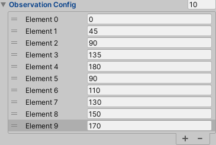

# 自動運転による競争

## 目次

- [概要](#概要)
- [ダウンロード](#ダウンロード)
- [基本ルール](#基本ルール)
- [Unity Editor上での操作説明](#unity-editor上での操作説明)
- [チュートリアル：AIの学習から対戦までの流れ](#チュートリアルaiの学習から対戦までの流れ)
- [対戦環境と同じセンサを使って学習させる方法](#対戦環境と同じセンサを使って学習させる方法)
- [今回のAI開発の基本的な流れ](#今回のai開発の基本的な流れ)
- [コード解説](#コード解説)
  - [スクリプトの編集について](#スクリプトの編集について)
- [入力変数の仕様](#入力変数の仕様)
- [出力変数の仕様](#出力変数の仕様)
- [対戦会で提出するファイル](#対戦会で提出するファイル)
- [最終回の対戦会について](#最終回の対戦会について)
- [Challenge環境について](#challenge環境について)
- [Python連携について](#python連携について)
- [対戦でPython連携を用いる方法](#対戦でpython連携を用いる方法)

## 概要
今回作ってもらうものは、入力として情報(センサ情報、自車の速度etc..)を受け取り、それを処理して車の操作を返すようなAIです。 \
入力情報をうまく処理して、適切な走行を実現するためにはどうすれば良いかを工夫してもらいます。 \
単純なものではルールベースに処理を行うようなものから、複雑なものではニューラルネットを使って処理を行うようなものまで、さまざまなやり方が考えられます。 \
サンプルコードとしてQ学習を用いたものとニューロ進化を用いたものがあるので参考にしてみてください。このQ学習やニューロ進化のコードをいじるという形でもいいですし、全く新しいものを作っても構いません。後述するルールを守る範囲内でいろいろ試してみてください。

## ダウンロード
[Google Driveのリンク](https://drive.google.com/drive/folders/1AFM1EUOxZcP6_mvdLRIu3a6Hy6E-0rbL?usp=sharing)からダウンロードし, 適当なフォルダで展開してください. その後, Unity HubのOpenから展開した.projフォルダを開いてください. 

Google DriveにはUnityのライブラリは上げていませんが, Unity Hubで開く際に自動的に生成されます.

macOS, Unity 2021.3.1f1以外で開く際には警告が出ますが, 警告に従ってバージョンの変更やパッケージのインストールなどをすれば以下の環境で動作することを確認しています. 

#### 動作確認
- macOS Monterey 12.4
- Windows 10
- Windows 11
- Unity 2021.3.0f1
- Unity 2021.3.1f1
- Unity 2021.3.3f1

## 基本ルール
- 車2台での対戦を行います(3台以上の対戦は行いません)。
- 先に一周した方の勝ちとなります。
- 壁や障害物に接触するとゲームオーバーになります。
- どちらも1周することなくゲームオーバーになった場合はより多くの距離を進んだ方の勝ちとなります。
- 対戦中に取得可能な情報は[入力変数の仕様](#入力変数の仕様)に記す46次元の情報のみです。

## Unity Editor上での操作説明
### Sceneの実行
ProjectタブのAssets > Scenesから選択したいシーンをダブルクリックして開きます.


Battleフォルダには対戦用のScene、NEとQにはそれぞれニューロ進化とQ学習用の学習環境が入っています。Challengeとついているものは障害物ありの環境です。
画面上部の再生ボタンを押すと対戦/学習が始まります. NE/Qの学習の場合はGame画面に表示されるスライダでプログラムの実行速度を調整できます. コンピュータへの負荷を少なくしたい場合は, 描画をオフにすることもできます。


## チュートリアル：AIの学習から対戦までの流れ
とりあえず，配布プログラムに用意されているニューロ進化の学習環境を使ってAIの学習を行い，対戦環境でテストドライブするまでの流れを体験してみましょう．

### 0. 注意：Unityプロジェクトでのファイルの扱いについて
Unityプロジェクト内のファイル（`Assets/`以下のフォルダ・ファイル）を移動したりする場合は，極力，**Unityエディタ上**（"Project"タブ）で行ってください．
ファイルエクスプローラーなど，Unityエディタ外でファイル操作を行う場合は，`(ファイル名).meta`も同時に移動させてください．

Unityでは，ファイルの識別をファイルのパスや名前ではなく，`.meta`ファイルに保存される`guid`という識別子で行っています．`guid`が適切に管理されないと，シーン上での参照関係が崩れて面倒なことになるので注意してください．

### 1. AIの学習（ニューロ進化）
配布プログラムに用意されているニューロ進化の学習環境を使ってAIの学習を行います．ニューロ進化のアルゴリズムなどの説明は教科書などを参照してください．

まずは，学習環境のシーンを開きます．ニューロ進化の学習環境は，`Assets/Scenes/NE/`や`Assets/Scenes/NE_Challenge/`にあります．好きなものを1つ選んで，開いてみましょう．
Unityエディタの"Hierarchy"タブから`Environment`というオブジェクトを選択すると，"Inspector"タブからニューロ進化のパラメータを変更することができます．

パラメータを設定したら，Unityエディタ上部中央の再生ボタンを押してシーンを実行してみましょう．ある程度，車が走れるようになったら，シーンの実行を終了して，学習結果が保存されていることを確認してみましょう．学習結果は，`Assets/LearningData/NE/{シーンの名前}.json`に保存されます．（Unityエディタ上では拡張子`.json`は省略されます．）このファイルには，ニューロ進化で得られたニューラルネットワークの重みなどの情報が保存されています．

もし，Unityエディタ上で学習結果のファイルが確認できない場合は，"Project"タブで右クリック→Refreshとするか，1世代以上学習させてみてください．また，シーンをもう一度実行すると前の学習結果が上書きされてしまうので，保存しておきたい場合は別名保存してください．

### 2. 対戦の準備
学習させたAI（ニューラルネット）を対戦環境で実行するための準備をします．

まずは，対戦に必要なものをまとめるフォルダ（例：`Assets/(自分の苗字)_NE/`）を作成します．（"Project"タブで右クリック→Create→Folder）
そのフォルダの中で，右クリック→Create→BattleBrain→NNBattleBrainと押して，対戦用のAIのアセットを作成します．名前は，`(自分の苗字)BattleBrain.asset`としてください．（拡張子`.asset`はUnityエディタ上では省略されます．）
そして，同じフォルダの中に，1.で得られたデータファイル（`*.json`）を移動，または，コピー＆ペーストします．
最後に，作成した`(自分の苗字)BattleBrain.asset`を選択して，"Inspector"タブで，`Name`に自分の名前を入力，`Brain Data`に先ほどのデータファイル`*.json`をドラッグ＆ドロップして使用するニューラルネットの情報を登録します．
これで，対戦用AIの準備は完了です．


### 3. 対戦環境でテストドライブ
2.で用意した対戦用AIを実際に対戦環境で走らせてみます．`Assets/Scenes/Battle/`から好きなコースを選んで，シーンを開きます．

"Hierarchy"タブで`AgentExecutor`というオブジェクトを探して選択し，"Inspector"タブ→AgentExecutor→Agents→Element0/1→Brainに，2.で作成した`(自分の苗字)BattleBrain.asset`をドラッグ＆ドロップで設定します．（右にある丸から選択することもできます．）
\


セットしたらUnityエディタ上部中央の再生ボタンを押してシーンを実行してみましょう．2台の車が競争するところを観察できます．

### 4. 対戦用ファイルの提出
最終日の対戦は，TAのPCで実行します．そのため，実行に必要なデータをまとめて提出してもらう必要があります．
このチュートリアルの場合は，2.で作成したフォルダ（`Assets/(自分の苗字)_NE/`）を丸ごと提出していただければ大丈夫です．
（提出する際に`.meta`ファイルも含まれていることを確認してください．）

## 対戦環境と同じセンサを使って学習させる方法
既存のNE/NE_challenge/QのSceneでは、学習に用いている車のオブジェクトが対戦で用いているものと違うため、限られたセンサ情報しか取得できません。
ここでは、学習環境を対応させる方法を説明します。
1. 対戦用のStage1をシーンとして開き、その中のset1/BattleCar_Blueをコピーします。(選択してctrl-cでコピー可能)


2. 対応させたい学習環境を開き、コピーしたものをペーストします。ここではNEのChallenge1を例に取ります。(ctrl-vでペースト可能)


3. BattleCar_Blueをクリックし、右側のインスペクタのLayerの部分をPlayerに変えます。  
**注意**：この時、子オブジェクトのLayerも変更するか聞かれますが、"Yes"にして子オブジェクトのLayerも変更して下さい。


4. BattleCar_Blue->Sensors->Sensors_0_Playerをクリックし、インスペクタからLayerNameをPlayerにします。これは、センサが認識する車のレイヤを変える処理です。
Sensors_1/2/3_Playerに関しても同様にします。


レイヤを変える前と後で、車が認識されるようになっているのがわかるかと思います。(赤いレイは車を感知していることを示している。)\
変更前\
\
変更後\


5. BattleCar_BuleのPositionをコースごとのスタートの位置に変えます。スタートの位置はCar@Blueと同じ位置、角度にしてあげれば大丈夫です。


6.Environmentオブジェクトをクリックし、インスペクタからNE EnvironmentのInput Sizeを46に変更し、Agent PrefabにBattleCar_BlueをHierarchyからドラッグアンドドロップで設定します。\


7.NEEnvironment.csのAgentUpdate関数内で、CollectObservations関数を用いていたのをGetAllObservations関数に変えてあげます。\


8. シーンを実行します。


## 今回のAI開発の基本的な流れ
1. AIの設計を考える。(必要に応じて学習などを行い、modelを保存したりする)
2. (自分の苗字小文字)BattleBrain.csのGetAction関数に、上で考えたAIによる処理を含むコードを実装する。
3. Assets→Create→BattleBrain→YourNameBattleBrainをクリックし、自分のAIのassetを作成する。これを(自分の苗字小文字)BattleBrain.assetとする。
4. Scenes/Battle/にある対戦用のシーンを開いて，(自分の苗字小文字)BattleBrain.aseetをAgentExecutorのInspector→Agents→Element0/1→Brainにセットする。
5. Unityの再生ボタンをクリックし、AIの挙動を確認する。\
なお、(自分の苗字小文字)BattleBrain.csを変更すると自動的にassetの方にも反映されるので、assetを何回も作り直す必要はありません。（Inspectorで変更できる変数は，場合によっては反映されないので注意．）

## コード解説
- `AI/Battle/(自分の苗字小文字)BattleBrain.cs`\
自動運転を実現するクラスを実装したコードで、今回の中核となるコードです。最初の時点では存在しないファイルなので、(自分の苗字小文字)BattleBrainという名前のファイルを最初に作ってください。提出の際に誰のファイルかを識別するために**非常に重要になります**。 \
このクラスを作る上で、**必ずBattleBrainクラスを継承してください。**
GetAction関数が入力変数observationを受け取り、出力変数であるactionを返します。\
  ```
  [CreateAssetMenu(menuName = "BattleBrain/YourNameBattleBrain")]
  public class YourNameBattleBrain : BattleBrain
  {
    public override double[] GetAction(List<double> observation) { }
  }
  ```
- `AI/AgentExecutor.cs`\
2台の対戦に使うコードです。最終回の対戦会もこのコードを用いて行います。開発時には主に作ったAIの性能をテストする目的で使ってもらうことになると思います。
このコードを使用する上で、基本的にコードそのものをいじる必要はありません。Inspector→Agents→Element0/1→Brainに自分が作ったAIのassetをセットしてもらうことで車を動かすことができます。
- `AI/NNBattleBrain.cs`\
ニューロ進化を用いた対戦用のAIを実装したコードです。学習済みのニューラルネットの重みをファイルから読み込んでいます。
- `AI/QBattleBrain.cs`\
Q学習を用いた対戦用のAIを実装したコードです。学習済みのQテーブルをファイルから読み込んでいます。
- `AI/Battle/BattleBrain.cs`\
今回の自動運転で作ってもらうXBrainクラスの継承元です。基本的にこのコードをいじる必要はありません。
- `AI/NEEnvironment.cs`\
ニューロ進化の学習を行うためのコードです。学習によって更新されたニューラルネットの重みをファイルに保存します。
- `Car/CarAgent.cs`\
  車をスタート地点にセットし, Brainにセンサーなど環境の値を渡します. Brainからの指示が来るのでそれに従って車を運転します. 衝突を検知すると報酬値を返し, 車をリセットします. 
- `Car/CarController.cs`\
  車の入力に対する動作が記述してあります (例： `steering`の値を受け取りタイヤを回転させる)\
教科書(Unityシミュレーションで学ぶ人工知能と人工生命)の2, 3章にサンプルコードが何をしているかがわかりやすく書いてあるので, 詳しくはそちらもご覧ください.


### スクリプトの編集について

配布しているスクリプトを編集したい場合は，スクリプトを複製（Unityエディタ上で選択して`Ctrl+D`）して，ファイル名・クラス名を変更してから編集することを推奨します．

最終日の対戦会では，基本的に，配布プログラムを配布している状態で実行します．（軽微な変更はあるかもしれません．）そのため，既存スクリプトに変更を加えても，本番の環境には反映されないので注意してください．皆さんが新しく作成したり編集したりしたスクリプトで，対戦時に必要なものは，対戦会前に提出してもらうことになりますが，本番環境のプログラムと競合するため，既存スクリプトと同名クラスのものは提出しないでください．

## 入力変数の仕様
入力変数はXBattleBrainのGetAction関数の引数として渡されます。内容は以下のような長さ46のリスト

| インデックス | 内容 |
| --- | --- |
| 0--4 | 前方の対壁センサー（Sensors_0_Wall）
| 5--9 | 右方の対壁センサー（Sensors_1_Wall）
| 10--14 | 左方の対壁センサー（Sensors_2_Wall）
| 15--19 | 後方の対壁センサー（Sensors_3_Wall）
| 20--24 | 前方の対車センサー（Sensors_0_Player）
| 25--29 | 前方の対車センサー（Sensors_1_Player）
| 30--34 | 前方の対車センサー（Sensors_2_Player）
| 35--39 | 前方の対車センサー（Sensors_3_Player）
| --- | --- |
| 40--42 | 自車のローカル速度 |
| --- | --- |
| 43--45 | コース上の前方向ベクトル（次のWaypointの方向）
| --- | --- |

となっています。
### センサー角度の設定の仕方
センサーの角度は調整することができる。以下仕様。\
`BattleBrain.Initialize()`の中などで`ObservationConfig`に長さ40の`List<double>`を設定する。
`observation`のセンサーと同じ順番。
長さが40に満たない場合，足りない部分はデフォルトのセンサー角度のまま。
長さが40を超える分は無視される。デフォルトでは以下のような設定になっている。


#### センサー角度を指定する例
以下のような`Initialize`関数を書くことで，前方の対壁センサーの角度を`[0，45, 90, 135, 180]`度に，右方の対壁センサーの角度を`[90, 110, 130, 150, 170]`度に，設定できる．（それ以外はデフォルトのまま．）
```
public override void Initialize() {
  base.Initialize();
  ObservationConfig = new List<double>(){
    0, 45, 90, 135, 180,
    90, 110, 130, 150, 170
  };
}
```
自分が作成した`BattleBrain`のアセットのInspectorタブから変更することも可能．
\


### 次のWaypointの方向に関する注意点
次のWaypointの方向に関する情報は`Waypoints/Waypoint.cs`の`NextDirection`変数に保存されているが、これは既にWaypointが配置されているシーンでは，`Waypoint.NextDirection`は自動的には計算されない。手動で`Set Next Direction`を押して設定するか`Set`し直す必要がある．


色んな工夫を可能にするために多くのデータを取っていますが、必ずしも全てを使う必要はありません(むしろ、考えなしに全ての変数を使うと多すぎると思います)。試行錯誤しながらどの変数を使うかを決めてください。


## 出力変数の仕様
出力変数はXBattleBrainのGetAction関数の返り値として渡されます。長さ3のdouble arrayで、順番に
- SteetInput(ハンドル)：[-1, 1]
- GasInput(アクセル)：[0, 1]
- BrakeInput(ブレーキ)：[0, 1]\
の値を返す必要があります。


## 対戦会で提出するファイル
自分で実装したコードが動くために必要なファイルを1つのフォルダにまとめて，指定の方法で提出してください．
**注意**：配布プログラムに含まれるファイルは提出しないでください．
- (自分の苗字小文字)BattleBrain.cs \
自動運転を実現するクラスを実装したコードです。`NNBattleBrain.cs`など既存のクラスを使用する場合は提出しなくて大丈夫です．
- (自分の苗字小文字)BattleBrain.asset\
上のBrainをasset化したものです。[今回のAI開発の基本的な流れ](#今回のAI開発の基本的な流れ)で説明した方法によって作られるものです。（エディタ上では拡張子`.asset`は省略されていますが，下のようなアイコンのファイルです．）\

- データファイル\
(自分の苗字小文字)BattleBrainで用いるデータファイルです。ニューロ進化におけるNNの重みやQ学習におけるQテーブルがこれに相当します。
- 上記3種のファイルのmetaファイル\
metaファイルはそれぞれのファイルと同フォルダ内に自動生成されるファイルです。

## 最終回の対戦会について
第10回目の演習で各々が作ったプログラム同士の対戦会をします。仕様は
- 各対戦は1対1の対決
- トーナメント方式(変更の可能性あり)
- コースは[Challenge環境について](#Challenge環境について)にあるChallenge1をベースにしたものを用いる(ただし岩の位置は変わる可能性がある)\
という感じになっています。もしここに書かれていない仕様について気になる人はTAに聞いてみてください。


## Challenge環境について
デフォルトで用意されている学習環境の中に、コース上の岩を避ける課題が用意されています. 最終回の対戦会でも岩のある環境を用いる予定ですので、Challenge環境を適宜活用してみてください。 シーンファイルは以下にあります. 各シーンを開き再生を押すとニューロ進化による学習が始まります. \
`/Assets/Scenes/NE_Challenge/Challenge*.unity`
### Challenge 1
コース上に数個の岩が設置されるのでその岩に当たらずにコースを一周できるように進化・学習させる(岩の位置は固定)
### Challenge 2
Challenge1と同じくコース上に数個の岩が設置されるのでその岩に当たらずにコースを一周できるように進化・学習させる(岩の位置は固定ではなくランダム)
### Challenge 3
坂の上から岩が転がり落ちてくるのでその岩に当たらずにコースを一周できるように進化・学習させる
### Challenge 4
コース上に一定間隔で岩が置かれていて近づくと転がり落ちてくる. 岩の大きさや速度はランダム

---

## Python連携について
Pythonを使うと, Numpyなどの数値計算モジュールやTensorflow, PyTorchなどの機械学習モジュールを用いることができます. 詳しくは教科書等を参考にしてください. 

### 準備
必要なパッケージがダウンロードされていない場合は`pip`などで適宜ダウンロードしてください. 
```shell
$ pip install numpy
$ pip install asyncio
$ pip install asyncio-dgram
$ pip install torch
```

### 使い方
1. ターミナルで`/env/src/PyNECommunicator.py`を実行している状態にします
```shell
$ python /env/src/PyNECommunicator.py
```
2. `/Asset/Scenes/PythonNE/`下のシーンファイルをUnityから実行します

現在`/env/src/PyNNBrain.py`は`NNBrain.cs`をPytorchに翻訳したものですが, Pythonで新しいニューラルネットワークの構造なども定義することができます. 

### SceneをPython対応させるには
通常のシーン(Challengeなど)をPythonに対応したシーンにするには以下の変更が必要です. 詳しくは既にPython対応しているシーンを参照して下さい. 
- EventSystemの追加\
ユーザーからの入力を受け取るものです. 今回はPythonからの入力を受け取っています. Python対応済みのシーンからのコピーで問題ないはずです.
- Environmentを`PyNEEnvironment.cs`にする\
`NEEnvironment.cs`を`PyNEEnvironment.cs`にします. また, Agent Prefabを`Car@Blue`に設定します. 

## 対戦でPython連携を用いる方法
対戦でpython連携を用いるためのコードのベースが`AI/PyNEBattleBrain.cs`に実装されています。
### 使い方
1. ターミナルで`/env/src/PyNECommunicator.py`を実行している状態にします
```shell
$ python /env/src/PyNECommunicator.py
```
2. バトル用のシーンを開き、AgentExecutorにPyNECommunicator.csのアセットをセットします(デフォルトで`Assets/BattleBrains/PyNEBB.assetが用意されています)。
3. シーンを実行します。

Python側ではあらかじめモデルをトレーニングしておき、その重みを保存しておくことが必要です(デフォルトでmodel_weight.pthが用意されています)。

### Python連携を用いたBattleBrainを作る場合
重要なこととして、Python連携を用いたBattleBrainを作る場合は、既存のPyNEBattleBrain.csを変更するのではなく、**新しく(自分の苗字小文字)BattleBrain.csを作成**して、`PyNEBattleBrain`を継承するか内容をコピペするかして、その上で編集してください。最終回の対戦会でファイル間の識別をスムーズに行うために重要になります。

